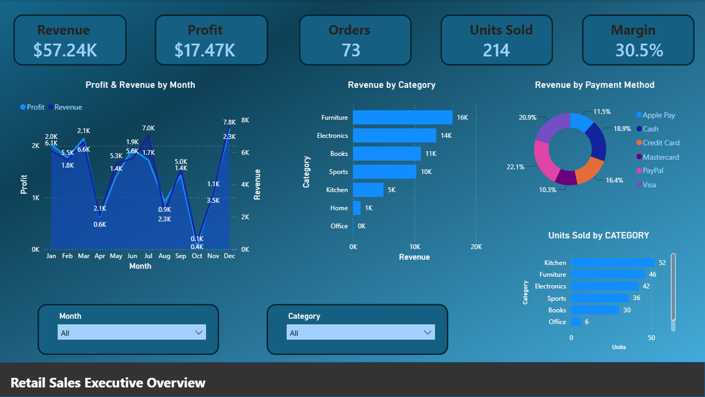
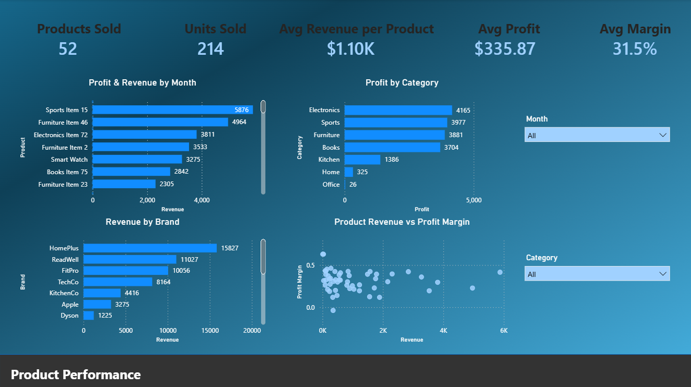
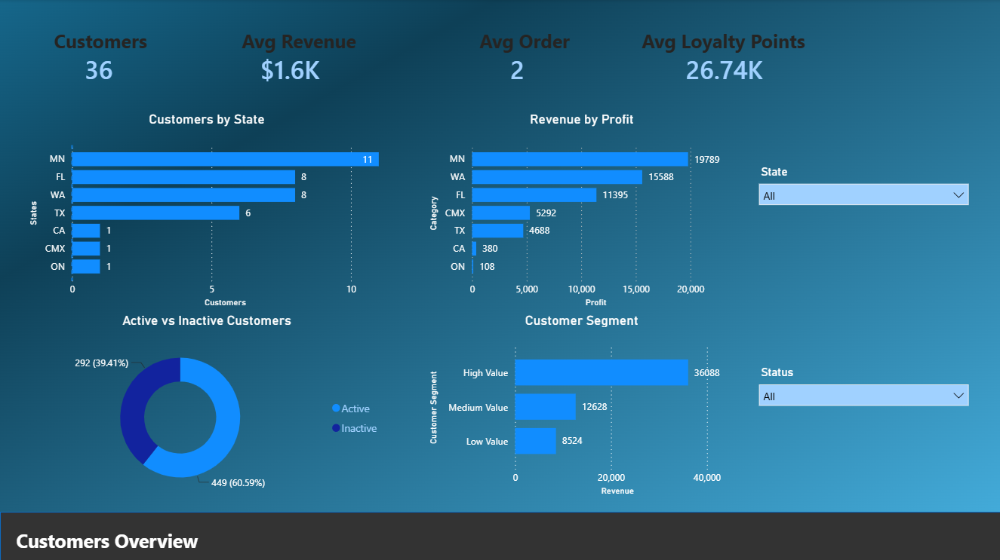

# Retail Data Engineering Pipeline

An end-to-end retail data engineering and analytics project that processes raw customer, product, and order data using **PySpark and AWS**, stores curated data using **Apache Iceberg**, integrates the data with **Snowflake**, and delivers business insights through **Power BI dashboards**.

## Architecture

```
Raw CSV Data
      ↓
  Amazon S3
      ↓
PySpark on Amazon EMR
      ↓
Data Cleaning & Transformation
      ↓
Apache Iceberg Tables
      ↓
Amazon S3 + AWS Glue Catalog
      ↓
Snowflake CURATED Layer
      ↓
Snowflake GOLD Dimensional Model
      ↓
Power BI

```

## Technologies Used

- **Languages:** Python, SQL, DAX
- **Data Processing:** PySpark
- **Cloud:** AWS S3, Amazon EMR, AWS Glue
- **Lakehouse:** Apache Iceberg
- **Data Warehouse:** Snowflake
- **Visualization:** Power BI
- **Version Control:** Git & GitHub

## Project Overview

The goal of this project was to build an end-to-end retail data pipeline that transforms raw transactional data into analytics-ready datasets.

The project uses three primary datasets:

- Customer data
- Product data
- Order data

Raw CSV files are stored in Amazon S3 and processed using PySpark on Amazon EMR. The cleaned datasets are stored as Apache Iceberg tables in S3 with metadata managed through AWS Glue Catalog.

Snowflake connects to the Iceberg tables and provides the warehouse layer used to create a Gold dimensional model. Power BI connects to the Gold layer for reporting and business analysis.

## Data Processing

PySpark is used to clean, validate, and transform the raw datasets.

Key data-quality operations include:

- Duplicate removal
- Null-value handling
- Schema and data-type validation
- Email and phone validation
- Date standardization
- Product and customer ID validation
- Payment method standardization
- Order status validation
- Numeric range validation
- Revenue and profit calculations

The cleaned customer, product, and order datasets are then joined to create an enriched sales dataset.

## Lakehouse Architecture

Curated datasets are stored as **Apache Iceberg tables in Amazon S3**.

**AWS Glue Catalog** manages the Iceberg table metadata, allowing the datasets to be accessed by other analytics platforms without duplicating the underlying data.

The curated layer includes datasets such as:

```
CUSTOMERS_CURATED
PRODUCTS_CURATED
ORDERS_CURATED
SALES_CURATED
CATEGORY_SUMMARY
PAYMENT_SUMMARY
MARGIN

```

## Snowflake Integration

Snowflake is integrated with AWS using an **External Volume** and **Catalog Integration**, allowing Snowflake to query the Iceberg tables registered in AWS Glue Catalog.

A Gold analytics layer is then created in Snowflake using a dimensional model.

### Gold Data Model

```
                 DIM_CUSTOMER
                      │
                      │
DIM_DATE ─────── FACT_SALES ─────── DIM_PRODUCT
                      │
                      │
               DIM_PAYMENT
                      │
               DIM_ORDER_STATUS

```

The `FACT_SALES` table contains transactional sales metrics, while dimension tables provide descriptive attributes used for filtering and analysis.

## Power BI Dashboard

Power BI connects to the Snowflake Gold layer to provide interactive retail analytics.

The report contains three main dashboard pages:

### Executive Dashboard

Provides a high-level view of business performance including:

- Total Revenue
- Total Profit
- Total Orders
- Total Units Sold
- Average Order Value
- Profit Margin
- Revenue trends

### Product Dashboard

Analyzes product and category performance including:

- Product revenue
- Product profitability
- Revenue by category
- Units sold
- Revenue vs. profit margin

### Customer Dashboard

Analyzes customer behavior while minimizing unnecessary exposure of personally identifiable information.

Includes:

- Total Customers
- Active vs. Inactive Customers
- Customer segmentation
- Revenue by customer segment
- Customer activity

For additional Power BI documentation and dashboard screenshots, see the [`Power BI`](Power_BI/) folder.

## Dashboard Preview

### Executive Dashboard



### Product Dashboard



### Customer Dashboard




## Repository Structure

```
Retail-Data-Pipeline/
│
├── data/
│   ├── customers.csv
│   ├── products.csv
│   └── orders.csv
│
├── pyspark/
│   └── project_1.py
│
├── snowflake/
│   ├── Retail_Gold_data.sql
│   ├── Retail_Iceberg_tables.sql
│   ├── Retail_project_setup.sql
│   └── Retail_Validation.sql
│
├── powerbi/
│   ├── README.md
│   ├── Retail_Dash.pbix
│   └── screenshots/
│
└── README.md

```

## Key Skills Demonstrated

This project demonstrates practical experience with:

- Building end-to-end ETL/data pipelines
- Data cleaning and validation with PySpark
- Working with distributed data processing using Amazon EMR
- Cloud object storage with Amazon S3
- Apache Iceberg table architecture
- AWS Glue Catalog metadata management
- Snowflake data warehousing
- Dimensional data modeling
- SQL-based data validation
- DAX measures and Power BI reporting
- Data visualization and business analytics

## Future Improvements

Potential improvements to the project include:

- Pipeline orchestration and scheduling
- Automated data-quality testing
- Incremental data processing
- CI/CD integration
- Pipeline monitoring and alerting
- Larger-scale datasets for performance testing
